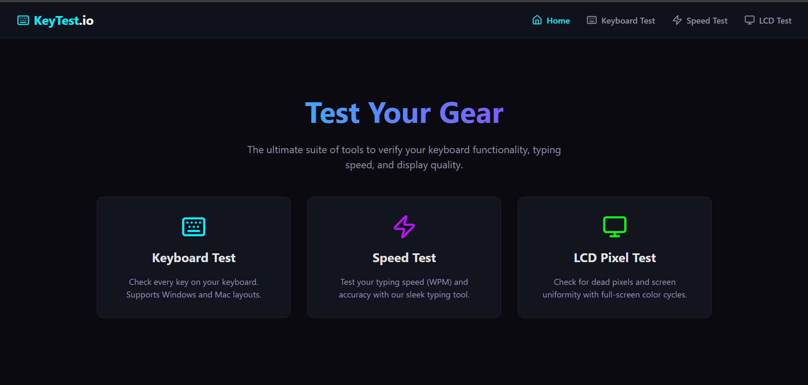

# Keyboard, Speed & LCD Tester 🚀

**Sebuah suite tools modern untuk menguji performa peripheral komputer Anda.**

Project ini dibuat sebagai demonstrasi kemampuan pengembangan web menggunakan teknologi modern seperti React dan Vite, dengan fokus pada _User Experience_ (UX) yang halus dan desain antarmuka yang premium.



## 🌟 Fitur Utama

### 1. Keyboard Test Ultimate

Uji fungsionalitas setiap tombol pada keyboard Anda dengan visualisasi real-time.

- Mendukung layout **Windows** dan **Mac**.
- Deteksi akurat untuk setiap key press.
- Visualisasi history penekanan tombol.

### 2. Speed Typing Test

Ukur kecepatan mengetik (WPM) dan akurasi Anda dengan antarmuka yang distraksi-free.

- Kalkulasi WPM (Words Per Minute) akurat.
- Highlight visual untuk karakter benar/salah.
- Animasi smooth dan responsif.

### 3. LCD Pixel Perfect

Cek kesehatan monitor Anda dari dead pixel atau stuck pixel.

- Mode layar penuh (Full Screen).
- Siklus warna lengkap (RGB, CMY, Black, White).

## 🛠️ Teknologi yang Digunakan

- **Core**: React 19, Vite
- **Styling**: Modern Vanilla CSS (CSS Variables, Flexbox/Grid, Glassmorphism)
- **Routing**: React Router DOM
- **Icons**: Lucide React

## 📦 Cara Install & Menjalankan

1.  **Clone repository ini**

    ```bash
    git clone https://github.com/username/keyboard-test.git
    cd keyboard-test
    ```

2.  **Install dependencies**

    ```bash
    npm install
    ```

3.  **Jalankan server development**

    ```bash
    npm run dev
    ```

4.  Buka browser dan kunjungi `http://localhost:5173`.

## 👨‍💻 Tentang Pembuat

Dibuat dengan ❤️ untuk komunitas developer Indonesia. Project ini menunjukkan implementasi bersih dari state management di React, penanganan DOM events untuk hardware input, dan praktik CSS modern tanpa framework CSS berat.

---

_Open Source Project - Silakan berkontribusi atau gunakan untuk belajar!_
